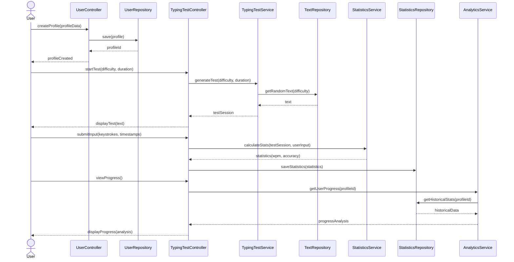

# Design

## Problem

There are many people who want to improve their typing skills, 
whether for professional or personal reasons. 
Typing tests help users identify their strengths and weaknesses, 
track their progress over time, and set goals for improvement.
The actual tools are only online services, but there are many users who want to use a local tool.

## Solution

Keyla: Typing Testing tools.
A local CLI tool that allows users to take typing tests, track their progress, and analyze their performance over time.

## Domain

The project is about the Digital Writing, 
this means the ability to write text using a computer keyboard with a certain speed and accuracy.

## Contexts (Bounded Contexts)
The Digital Writing domain has been divided into three main contexts to manage complexity and ensure clarity of responsibilities:

- **User Management**: User profile management (allow users to create and manage their profiles)
- **Typing Test**: Typing test management (allow users to take typing tests and record their performance, here the user can choose the settings of the test)
- **Statistics & Analytics**: Statistics and analytics management (allow users to view their performance statistics and the improvement/results over time)

<!-- Description: Context Map showing User Management, Typing Test, and Statistics & Analytics and their relationships. -->

## Ubiquitous Language

To facilitate communication between the team and stakeholders, a shared language has been defined:

| Domain Term            | Technical Concept     | Description                                                                                              |
|:-----------------------|:----------------------|:---------------------------------------------------------------------------------------------------------|
| User Profile           | `Profile`             | Account identified by a unique name to access the tool                                                   |
| Profile ID             | `ProfileId`           | Unique identifier of a profile                                                                           |
| Preferences            | `Settings`            | Set of specific features of the profile                                                                  |
| Test Session           | `TestSession`         | Typing test instance started by a user                                                                   |
| Test Text              | `TestText`            | Words, symbols, and numbers to be typed during the test                                                  |
| User Input             | `UserInput`           | Text actually typed by the user, with a timestamp for each character                                     |
| Test Sources           | `TestSource`          | Dictionary from which the test draws for word selection                                                  |
| Text Generator         | `TestTextGenerator`   | Service that randomly generates the text to be typed                                                     |
| WPM (Words per minute) | `WPM`                 | Metric: number of correctly typed words                                                                  |
| Accuracy               | `Accuracy`            | Percentage of correct characters out of the total typed                                                  |
| Raw Accuracy           | `RawAccuracy`         | Percentage of correct characters out of the total characters in the test                                 |
| Statistics             | `Stats`               | Performance data saved after each test                                                                   |
| Analytics              | `HistoricalStats`     | Table showing statistics over time                                                                       |
| Statistics Calculator  | `StatsCalculator`     | Service that calculates WPM and Accuracy                                                                 |
| Analytics Calculator   | `AnalyticsCalculator` | Service that calculates average WPM and average Accuracy, total test, percentage of errors, total errors |

## Domain Model

### User Management

- **Aggregate Root**: `PROFILE`
  - Controls access to profile data (ID, Name) and profile configurations (Settings)
- **Value Object**: `SETTINGS`
  - List of features selectable by the user
- **Repository**: `ProfileRepository`
- **Factory**: `ProfileFactory`
- **Domain Event**: Profile Created, Profile Updated, Profile Deleted

The User Management context centers around the PROFILE aggregate root, which controls access to user profile data and configurations. 
Each profile has associated SETTINGS as a value object that encapsulates user preferences like theme, language, and default test parameters. 
The ProfileRepository provides persistence capabilities, while the ProfileFactory handles the creation of new profiles. 
Domain events (ProfileCreated, ProfileUpdated, and ProfileDeleted) allow the system to track and react to changes in user profiles, enabling loose coupling between components.

### Typing Test

- **Aggregate Root**: `TEST SESSION`
  - Controls Test Text, User Input, and state transitions
- **Value Object**:
  - `TEST TEXT`: text to be typed during the test
  - `USER INPUT`: everything the user does during the test
DDD  - `TEXT SOURCE`: dictionaries for text generation in different languages
- **Repository**:
  - `TextSourceRepo`: dictionaries for text generation
  - `TypingTestRepo`: info about tests before execution
  - `TestInfoRepo`: data about tests performed by the user (duration, words, errors, etc.)
- **Factory**: `TestSessionFactory`
- **Service Object**: `TestTextGenerator`
- **Domain Event**: Test Start, Test Completed, Test Interrupt (Ctrl+C → returns to home without saving stats)

The Typing Test context revolves around the TEST_SESSION aggregate root that manages the state and lifecycle of typing tests.
It contains value objects like TEST_TEXT (the content to be typed), USER_INPUT (keystrokes recorded during the test), and references TEXT_SOURCE (dictionaries for text generation). 
Multiple repositories handle different aspects of test data persistence: TextSourceRepo manages dictionaries, TypingTestRepo stores test session data, and TestInfoRepo maintains historical test information. 
The TestTextGenerator service generates appropriate texts based on difficulty settings, while domain events (TestStart, TestCompleted, and TestInterrupt) mark important transitions in the test lifecycle.
### Statistics & Analytics

- **Aggregate Root**: `STATISTICS`
  - Controls Session Stats and Historical Stats
- **Value Object**:
  - `STATISTICS`: statistics of the single test session
  - `ANALYTICS`: aggregated statistics
  - `STAT`: interface for calculating WPM, Accuracy, RawAccuracy
- **Repository**: `StatisticsRepo`
- **Service Object**: Statistics Calculator, Analytics Calculator

The Statistics & Analytics context is built around the STATISTICS aggregate root that manages both immediate test results and historical performance data. 
It comprises value objects like SESSION_STATS (metrics from a single test) and HISTORICAL_STATS (aggregated performance over time). 
The STAT interface defines the contract for various statistical calculations. 
The StatisticsRepo provides persistence for both session and historical statistics, while service objects (StatisticsCalculator and AnalyticsCalculator) implement the algorithms for computing performance metrics and trend analysis.
## Technical Architecture

Keyla's architecture is designed to be modular and maintainable, following the principles of Domain-Driven Design (DDD). It separates concerns into distinct layers, allowing for clear boundaries between domain logic, application services, user interfaces, and infrastructure components.

| Layer              | Components                                                                                                                                                                                                             |
|--------------------|------------------------------------------------------------------------------------------------------------------------------------------------------------------------------------------------------------------------|
| **Domain**         | `SETTINGS`, `PROFILE`, `Profile Created`, `Profile Updated`, `Profile Deleted`, `TEST TEXT`, `USER INPUT`, `TEXT SOURCE`, `TEST SESSION`, `Test Start`, `Test Completed`, `Test Interrupt`, `STATISTICS`, `ANALYTICS`  |
| **Application**    | `TestTextGenerator`, `Statistics Calculator`, `Analytics Calculator`                                                                                                                                                   |
| **User Interface** | CLI, REST API                                                                                                                                                                                                          |
| **Infrastructure** | Data Sources                                                                                                                                                                                                           |

The User Interface layer provides access through both CLI and REST API interfaces. These interfaces communicate with the Application layer, which contains service components like TestTextGenerator, Statistics Calculator, and Analytics Calculator that implement the core business logic. 
The Domain layer is organized into three bounded contexts (User Management, Typing Test, and Statistics & Analytics), each containing its domain entities, value objects, and domain events. 
The Infrastructure layer handles persistence through various repositories that store and retrieve domain objects from the data sources.
The diagram clearly illustrates the dependencies between layers, showing how each layer depends only on the layers beneath it, which enforces a clean separation of concerns and makes the system more maintainable and extensible.

## Patterns and Design Choices
Keyla employs several design patterns to ensure a clean architecture:
- **Domain Driven Design (DDD)** for modeling the domain and its contexts
- **Repository** pattern for abstracting data access
- **Factory** pattern for creating complex objects like profiles, test sessions and statistics 
- **Service Object** pattern for encapsulating domain logic 

## Information Flow

The typical flow starts from the user interface (CLI or API), which sends requests to the application services. These orchestrate operations on the domain and interact with repositories for persistence.

<!-- Insert UML sequence diagram image -->

<!-- Description: UML sequence diagram showing the flow of a test session, from profile creation, test start, to statistics saving. -->
The process begins with user profile creation: the user interacts with the UserController, which in turn collaborates with the UserRepository to persistently store profile data. 
Once this initial phase is completed, the flow continues with the start of a typing test, where the TypingTestController requests the TypingTestService to generate a new test based on the selected difficulty and duration parameters. 
The service obtains an appropriate text from the TextRepository and prepares the test session that is presented to the user.
During the test execution, the system records each keystroke of the user along with the corresponding timestamps. 
At the end of the exercise, this data is sent to the StatisticsService which calculates fundamental metrics such as typing speed (WPM) and accuracy. 
The results are saved to the database through the StatisticsRepository. 
The flow concludes when the user requests to view their progress: the TypingTestController delegates to the AnalyticsService the retrieval of historical data from the StatisticsRepository to generate a comparative analysis that shows the average of performance over time.

## Considerations on Extensibility and Maintainability

The clear separation between contexts and the adoption of established patterns make Keyla easily extensible and maintainable. New features can be added without impacting existing components.

---