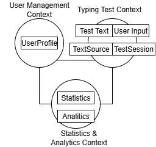

# Design

## Problem

There are many people who want to improve their typing skills, 
whether for professional or personal reasons. 
Typing tests help users identify their strengths and weaknesses, 
track their progress over time, and set goals for improvement.
The actual tools are only online services, but there are many users who want to use a local tool.

## Solution

Keyla: Typing Testing tools.
A local CLI tool that allows users to take typing tests, track their progress, and analyze their performance over time.

## Domain

The project is about the Digital Writing, 
this means the ability to write text using a computer keyboard with a certain speed and accuracy.

## Contexts (Bounded Contexts)
The Digital Writing domain has been divided into three main contexts to manage complexity and ensure clarity of responsibilities:

- **User Management**: User profile management (allow users to create and manage their profiles)
- **Typing Test**: Typing test management (allow users to take typing tests and record their performance, here the user can choose the settings of the test)
- **Statistics & Analytics**: Statistics and historical data management (allow users to view their performance statistics and historical trends)

<!-- Insert UML diagram image -->
<!-- Description: Context Map showing User Management, Typing Test, and Statistics & Analytics and their relationships. -->

## Ubiquitous Language

To facilitate communication between the team and stakeholders, a shared language has been defined:

| Domain Term           | Technical Concept        | Description                                                                 |
| :-------------------- | :---------------------- | :-------------------------------------------------------------------------- |
| User Profile          | `Profile`               | Account identified by a unique name to access the tool                      |
| Profile ID            | `ProfileId`             | Unique identifier of a profile                                              |
| Preferences           | `Settings`              | Set of specific features of the profile                                     |
| Test Session          | `TestSession`           | Typing test instance started by a user                                      |
| Test Text             | `TestText`              | Words, symbols, and numbers to be typed during the test                     |
| User Input            | `UserInput`             | Text actually typed by the user, with a timestamp for each character        |
| Test Sources          | `TestSource`            | Dictionary from which the test draws for word selection                     |
| Text Generator        | `TestTextGenerator`     | Service that randomly generates the text to be typed                        |
| WPM (Words per minute)| `WPM`                   | Metric: number of correctly typed words                                     |
| Accuracy              | `Accuracy`              | Percentage of correct characters out of the total typed                     |
| Raw Accuracy          | `RawAccuracy`           | Percentage of correct characters out of the total characters in the test    |
| Statistics            | `Stats`                 | Performance data saved after each test                                      |
| Historical Trend      | `HistoricalStats`       | Graph or table showing statistics over time                                 |
| Statistics Calculator | `StatsCalculator`       | Service that calculates WPM and Accuracy                                    |

## Domain Model

### User Management

- **Aggregate Root**: `PROFILE`
  - Controls access to profile data (ID, Name) and profile configurations (Settings)
- **Value Object**: `SETTINGS`
  - List of features selectable by the user
- **Repository**: `ProfileRepository`
- **Factory**: `ProfileFactory`
- **Domain Event**: Profile Created, Profile Updated, Profile Deleted

### Typing Test

- **Aggregate Root**: `TEST SESSION`
  - Controls Test Text, User Input, and state transitions
- **Value Object**:
  - `TEST TEXT`: text to be typed during the test
  - `USER INPUT`: everything the user does during the test
  - `TEXT SOURCE`: dictionaries for text generation in different languages
- **Repository**:
  - `TextSourceRepo`: dictionaries for text generation
  - `TypingTestRepo`: info about tests before execution
  - `TestInfoRepo`: data about tests performed by the user (duration, words, errors, etc.)
- **Factory**: `TestSessionFactory`
- **Service Object**: `TestTextGenerator`
- **Domain Event**: Test Start, Test Completed, Test Interrupt (Ctrl+C → returns to home without saving stats)

### Statistics & Analytics

- **Aggregate Root**: `STATISTICS`
  - Controls Session Stats and Historical Stats
- **Value Object**:
  - `SESSION STATS`: statistics of the single test session
  - `HISTORICAL STATS`: aggregated statistics
  - `STAT`: interface for calculating WPM, Accuracy, RawAccuracy
- **Repository**: `StatsRepo`
- **Service Object**: Statistics Calculator, Statistics Comparator

<!-- Insert UML diagram image -->
<!-- Description: UML diagram of the domain model with aggregate root, value object, repository, factory, and service object for each context. -->

## Technical Architecture

Keyla's architecture is designed to be modular and maintainable, following the principles of Domain-Driven Design (DDD). It separates concerns into distinct layers, allowing for clear boundaries between domain logic, application services, user interfaces, and infrastructure components.

| Layer              | Components                                                                                                                                                                                                                                              |
|--------------------|---------------------------------------------------------------------------------------------------------------------------------------------------------------------------------------------------------------------------------------------------------|
| **Domain**         | `SETTINGS`, `PROFILE`, `Profile Created`, `Profile Updated`, `Profile Deleted`, `TEST TEXT`, `USER INPUT`, `TEXT SOURCE`, `TEST SESSION`, `Test Start`, `Test Completed`, `Test Interrupt`, `SESSION STATS`, `HISTORICAL STATS`, `STAT`, `STATISTICS`   |
| **Application**    | `TestTextGenerator`, `Statistics Calculator`, `Statistics Comparator`                                                                                                                                                                                   |
| **User Interface** | CLI, REST API                                                                                                                                                                                                                                           |
| **Infrastructure** | Data Sources                                                                                                                                                                                                                                            |

<!-- Insert UML diagram image -->
<!-- Description: UML diagram showing the division into layers (Domain, Application, User Interface, Infrastructure) and their dependencies. -->

## Patterns and Design Choices
Keyla employs several design patterns to ensure a clean architecture:
- **Domain Driven Design (DDD)** for modeling the domain and its contexts
- **Repository** pattern for abstracting data access
- **Factory** pattern for creating complex objects like profiles, test sessions and statistics 
- **Service Object** pattern for encapsulating domain logic 

## Information Flow

The typical flow starts from the user interface (CLI or API), which sends requests to the application services. These orchestrate operations on the domain and interact with repositories for persistence.

<!-- Insert UML sequence diagram image -->
<!-- Description: UML sequence diagram showing the flow of a test session, from profile creation, test start, to statistics saving. -->
## Considerations on Extensibility and Maintainability

The clear separation between contexts and the adoption of established patterns make Keyla easily extensible and maintainable. New features can be added without impacting existing components.

---