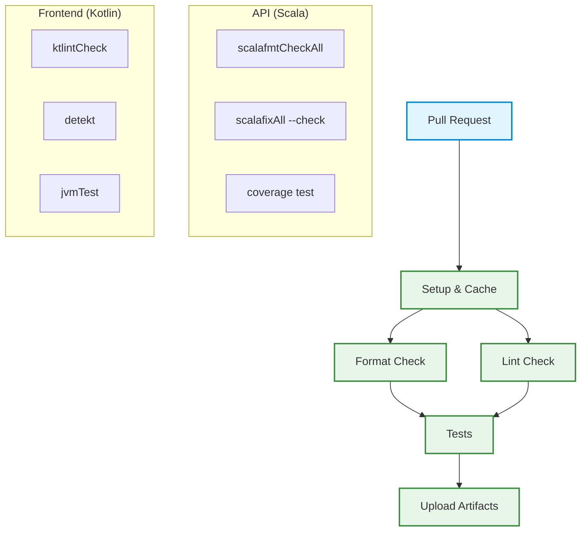

# CI/CD

This chapter describes the complete implementation of Continuous Integration and Continuous Deployment (CI/CD) in the Keyla-TTT project, including continuous integration pipelines, automated release processes, pre-commit hooks, and Docker image management.

## 1. CI/CD Architecture

The Keyla-TTT project implements a multi-repository CI/CD architecture that coordinates three main components:

- **Keyla-API**: Scala Backend with SBT
- **Keyla-CLI**: Kotlin Multiplatform Application with Gradle  
- **Keyla-RELEASE**: Release repository that aggregates components and produces Docker images

### Development Workflow

The project adopts a GitFlow-based workflow with the following branches:

- **`develop`**: Integration branch for new features
- **`main`**: Stable production branch
- **`release`**: Trigger branch for automated release process
- **`feature/*`**: Branches for new feature development

### Commit Conventions

The project uses **Conventional Commits** to standardize commit messages, enabling automated versioning and changelog generation.

## 2. Pre-commit Hooks

The project implements separate pre-commit hooks for backend and frontend to ensure code quality before every commit.

### Backend (API Scala) - Pre-commit Hook

The Scala backend implements a pre-commit hook that ensures code quality before every commit. The hook automatically identifies modified Scala files and runs formatting checks (`scalafmtCheck`) and static analysis (`scalafixAll --check`). If any checks fail, it automatically applies corrections using `scalafmtAll` and `scalafixAll`, then adds the corrected files to the commit.

### Frontend (CLI Kotlin) - Pre-commit Hook

The Kotlin frontend implements a more complex pre-commit hook that includes tests. The hook runs code quality checks using `ktlintCheck` and `detekt`, auto-formats code with `ktlintFormat` if issues are found, and then executes the complete test suite with `allTests`. The commit is blocked if any check fails.

### Commit Message Validation

Both backend and frontend use a `commit-msg` hook that validates commit message format according to Conventional Commits standards. The hook enforces the pattern `type(scope): description` where type must be one of: feat, fix, docs, style, refactor, test, chore, perf, ci, build, or revert.

## 3. Continuous Integration Pipelines

### API (Scala) - CI Pipeline

The CI pipeline for the API is defined in `.github/workflows/scala.yml` and triggers on pull requests to develop and main branches. The pipeline consists of four main jobs:

1. **Setup**: Configures the environment and caches SBT dependencies for faster subsequent runs
2. **Format**: Verifies code formatting using `scalafmtCheckAll`
3. **Lint**: Performs static analysis using `scalafixAll --check`
4. **Test**: Runs the test suite with code coverage reporting using Scoverage, then uploads coverage reports as artifacts

### Frontend (CLI Kotlin) - CI Pipeline

The CI pipeline for the frontend is defined in `.github/workflows/kotlin.yml` and triggers on pull requests to develop and main branches. The pipeline consists of three main jobs:

1. **Setup**: Configures the environment with JDK and caches Gradle dependencies
2. **Check**: Runs code quality checks using `ciCheckCode` which includes ktlint and detekt
3. **Test**: Executes the JVM test suite and uploads test results as artifacts

### CI Pipeline Diagram

## 4. Automated Release Process

### Release Triggers

The release process is triggered by pushes to the `release` branch of each repository. An automatic workflow (`push_on_release.yml`) keeps the `release` branch synchronized with `main` by automatically updating the release branch whenever changes are pushed to main or when pull requests are merged.

### API (Scala) Release

The release process for the API includes:

1. **Documentation Generation**: API documentation creation with SBT
2. **Documentation Deploy**: Publication to GitHub Pages
3. **Universal Package Build**: ZIP package creation for distribution
4. **Semantic Release**: Automatic versioning and GitHub release creation
5. **Release Repository Trigger**: Notification to Keyla-RELEASE repository

The workflow generates the API documentation, deploys it to GitHub Pages, creates a universal ZIP package for distribution, and uses semantic-release to automatically determine the version number based on commit messages. Upon successful release, it triggers the Keyla-RELEASE repository to update the Docker image.

### Frontend (CLI Kotlin) Release

The release process for the frontend includes:

1. **Multi-Platform Build**: Compilation for Linux, macOS and Windows
2. **Documentation Generation**: Documentation creation with Dokka
3. **Semantic Release**: Automatic versioning with binary assets
4. **Release Repository Trigger**: Notification to Keyla-RELEASE repository

The workflow uses a matrix strategy to build native executables for multiple platforms (Linux x64, macOS ARM64, Windows x64) using Kotlin Native. It generates documentation with Dokka, creates platform-specific binaries, and uses semantic-release to automatically version and attach the binaries to GitHub releases. Upon successful release, it triggers the Keyla-RELEASE repository to update the Docker image.

## 5. Release Repository and Containerization

### Keyla-RELEASE Repository

The Keyla-RELEASE repository aggregates released components and produces Docker images. It's triggered by `repository_dispatch` events from API and CLI repositories.

**Complete Process:**
1. **Trigger**: Activated by API or CLI release via `repository_dispatch`
2. **Resolve Tags**: Determines latest versions of both components
3. **Download Assets**: Downloads API ZIP package and CLI binaries
4. **Create Combined Tag**: Generates combined tag `v<api_version>.<cli_version>`
5. **Build Docker Image**: Creates and publishes Docker image to Docker Hub
6. **Create Release**: Creates GitHub release with combination details

The workflow resolves the latest versions of both components when one is released, downloads the appropriate assets, creates a combined version tag, builds a Docker image that includes both the API and CLI components, and publishes it to Docker Hub with both the specific version tag and the latest tag.

### Docker Image

The final Docker image (`keylattt/keyla`) combines:

- **Backend API**: ZIP package of the Scala application
- **CLI Binaries**: Native executables for Linux, macOS and Windows
- **Dictionaries**: Dictionary files for typing tests
- **Scripts**: Installation and startup scripts

The Docker image is based on OpenJDK 11 JRE and includes all necessary components for running the complete Keyla application. It sets up the proper directory structure, installs the CLI binary as a system command, extracts and configures the API, and provides startup scripts to run both components together.

## 6. Automation and Code Quality

### Quality Tools

- **Scala (API)**:
  - `scalafmt`: Automatic code formatting
  - `scalafix`: Static analysis and automatic refactoring
  - `scoverage`: Code coverage

- **Kotlin (Frontend)**:
  - `ktlint`: Kotlin code formatting and linting
  - `detekt`: Static analysis for Kotlin
  - `dokka`: Documentation generation

### Caching and Optimization

Pipelines use extensive caching to optimize execution times:

- **SBT Cache**: Cache for Scala dependencies and compilations
- **Gradle Cache**: Cache for Kotlin dependencies and builds
- **Node Modules Cache**: Cache for JavaScript dependencies
- **Docker Layer Cache**: Cache for Docker layers

## 7. GitHub Integration

- **Pull Request Checks**: Automatic checks on every PR
- **Release Notes**: Automatic release notes generation
- **Changelog**: Automatic changelog based on commits
- **GitHub Pages**: Automatic documentation deployment