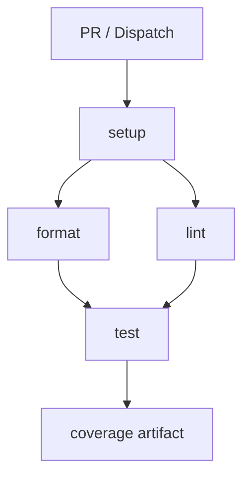
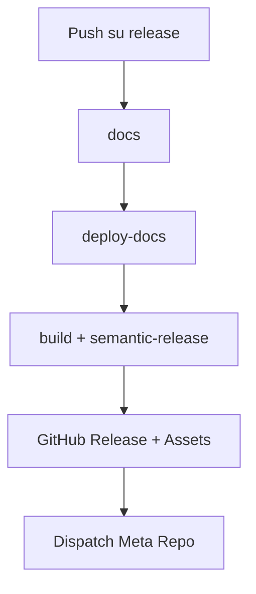

## 4. CI/CD con GitHub Actions (API - Scala)

### 4.1.1 Panorama dei Workflow
| Workflow | File | Trigger | Scopo sintetico |
|----------|------|---------|-----------------|
| CI Scala | `\.github/workflows/scala.yml` | `pull_request` (verso `develop`,`main`), `workflow_dispatch` | Validazioni qualità (format, lint, test, coverage) |
| Sync Release Branch | `\.github/workflows/push_on_release.yml` | `push` / PR chiusa su `main`, manuale | Allinea `release` a `main` |
| Semantic Release + Docs | `\.github/workflows/release.yml` | `push` su `release`, manuale | Genera docs, pubblica Pages, crea release + asset |

---

### 4.1.2 Workflow CI (`scala.yml`)
Obiettivo: impedire l’ingresso in `develop` / `main` di codice non formattato, non conforme o con test rotti.

Trigger:
- `pull_request`: garantisce feedback precoce sulle modifiche destinate a rami principali.
- `workflow_dispatch`: esecuzione manuale per verifiche spot.

Jobs (ordine logico):

#### Job: `setup`
Funzione: prepara ambiente e popola cache per velocizzare i job successivi.  
Passi principali:
- Checkout: recupera il codice.
- `sbt/setup-sbt`: abilita wrapper e configurazioni SBT.
- Cache (cartelle `~/.sbt`, `~/.ivy2/cache`, `~/.coursier/cache`): riduce tempi di download dipendenze.
- Output `cache-hit`: può essere usato per logiche condizionali future (non ancora sfruttato).

#### Job: `format` (dipende da `setup`)
Scopo: bloccare codice non formattato.  
Passi:
- Restore cache (ripete per isolamento del job).
- Setup JDK 21 (distribuzione Temurin) con cache integrata.
- Esegue `sbt scalafmtCheckAll`: fallisce se anche un solo file non è conforme.

#### Job: `lint` (dipende da `setup`)
Scopo: controllo statico.  
Passi:
- Setup analogo a `format`.
- Esegue `sbt "scalafixAll --check"`: verifica regole di refactoring e qualità. Non modifica i file (modalità check).

#### Job: `test` (dipende da `format` e `lint`)
Scopo: validazione funzionale + coverage.  
Passi:
- Setup ambiente (checkout + cache).
- `sbt clean coverage test coverageReport`:
    - `coverage`: attiva strumentazione.
    - `test`: esegue suite.
    - `coverageReport`: genera report (es. scoverage).
- Upload artifact (cartella `target/scala-*/scoverage-report`): rende disponibile il report per consultazione / aggregazione futura.

Note operative e possibili estensioni interne alla sezione (non nuovi paragrafi):
- Aggiungibile un job `sonar` dopo `test` (`needs: test`).
- Aggiungere `concurrency: { group: ci-${{ github.ref }}, cancel-in-progress: true }` per evitare esecuzioni duplicate su PR aggiornate.
- Inseribile soglia coverage (`sbt coverageAggregate` + parsing) per fallire sotto un limite.

Diagramma:

---

### 4.1.3 Workflow Sync Branch (`push_on_release.yml`)
Obiettivo: mantenere `release` come riflesso immediato e controllato di `main`, separando l’atto di pubblicazione (che avviene solo su `release`).

Trigger:
- `push` su `main`: ogni aggiornamento stabile.
- `pull_request` chiusa verso `main`: copre merge via PR.
- `workflow_dispatch`: fallback manuale.

Job: `update-release-branch`  
Passi:
- Checkout con `fetch-depth: 0` (serve la storia completa in caso di future analisi o tag).
- Configurazione identità Git (necessaria per push).
- `git checkout -B release`: crea o riallinea branch locale.
- `git push --force`: garantisce identità tra `main` e `release` (scelta consapevole: sovrascrive divergenze).
- Notifica testuale (log di auditing).

Rischio noto: perdita di commit manuali su `release` (devono essere evitati per policy).

---

### 4.1.4 Workflow Release + Documentazione (`release.yml`)
Obiettivo: pipeline integrata di documentazione, pubblicazione della versione e distribuzione artefatti.

Trigger:
- `push` su `release`: solo dopo riallineamento da `main`.
- `workflow_dispatch`: rilancio manuale (es. in caso di fix su configurazioni).

Permissions:
- `contents: write`: tag + release + eventuali commit (changelog).
- `pages: write` + `id-token: write`: distribuzione GitHub Pages sicura (OIDC).

Jobs (pipeline sequenziale):

#### Job: `docs`
Scopo: generare documentazione API (Scaladoc).  
Passi:
- Checkout + setup SBT + cache dipendenze.
- JDK 21 (coerente con build principale).
- `sbt doc`: genera documentazione in `target/scala-*/api`.
- Copia in struttura piatta (`docs-to-deploy`) per conformità a Pages.
- Artifact upload (`api-documentation`): passaggio inter-job affidabile.

#### Job: `deploy-docs` (needs: `docs`)
Scopo: pubblicazione su GitHub Pages.  
Passi:
- Download artifact (isolamento: non richiede ricostruzione).
- Log diagnostico (listing file).
- `actions/configure-pages`: prepara ambiente.
- Upload artifact dedicato a Pages.
- Deploy con `actions/deploy-pages`: espone URL (esportato come output `page_url`).

#### Job: `release` (needs: `deploy-docs`)
Scopo: creare release versionata con asset binari.  
Passi:
- Checkout intero (storia necessaria per semantic-release).
- Setup SBT + cache.
- Build pacchetto distributivo: `sbt Universal/packageBin` → ZIP in `target/universal`.
- Setup Node (ambiente tool di rilascio).
- Installazione dipendenze `semantic-release` (plugin core: analyzer, notes, git, github).
- Preparazione cartella `release-assets`.
- Copia ZIP dentro `release-assets` (sarà allegato).
- Config Git (necessario se plugin `@semantic-release/git` aggiorna `CHANGELOG.md`).
- Esecuzione `npx semantic-release`:
    - Analizza commit (Conventional Commits).
    - Determina tipo di versione (major/minor/patch).
    - Genera changelog.
    - Crea tag + GitHub Release.
    - Allegare asset (richiede config file con `assets`).
- Dispatch verso repository `Keyla-RELEASE` (evento `new-release`) per orchestrazioni esterne/aggregazioni future.
    - Usa `PAT_TOKEN` (scope repo) perché `GITHUB_TOKEN` non può dispatchare cross-repo in alcuni casi di restrizione.

Diagramma:

Nota: eventuali failure in `deploy-docs` bloccano la pubblicazione (consistenza docs-versione).

---

### 4.1.5 Semantic Release: Regole e Mappature
Logica di bump automatico:
- `feat:` → minor
- `fix:` / `perf:` → patch
- `refactor:` / `docs:` / `chore:` / `test:` / `style:` → nessun bump (se senza `BREAKING CHANGE`)
- Presenza di testo `BREAKING CHANGE:` (o `!` nel tipo) → major

Prerequisiti qualitativi:
- Commit lint (pre-merge) per evitare messaggi non conformi.
- Evitare push diretti su `release` (solo sync automatica).

---

### 4.1.6 Checklist Operativa
- \[ \] Conventional Commits applicati su tutte le PR
- \[ \] Protezione branch `main` / `release`
- \[ \] Coverage minima definita e verificata
- \[ \] (Opzionale) Analisi SonarCloud integrata post-test
- \[ \] Artifact ZIP presente e allegato nelle release
- \[ \] Docs pubblicate contestualmente alla versione
- \[ \] Evento `repository-dispatch` ricevuto correttamente dal repo aggregatore
- \[ \] Changelog generato automaticamente senza conflitti di merge

---

### 4.1.7 Sintesi
Il modello separa chiaramente:
- Validazione continua (CI su PR)
- Stabilizzazione (`main`)
- Pubblicazione controllata (`release`)
- Distribuzione documentazione + asset coerenti con la versione

Questa stratificazione riduce rischi (release premature), incrementa tracciabilità e facilita l’estensione futura ad altri componenti (CLI, meta-release) senza modificare il core del flusso esistente. del merge su `main`, un'azione di `semantic-release` analizza i messaggi di commit, determina automaticamente la nuova versione del software secondo le regole del Semantic Versioning, genera un changelog e crea una nuova release su GitHub.