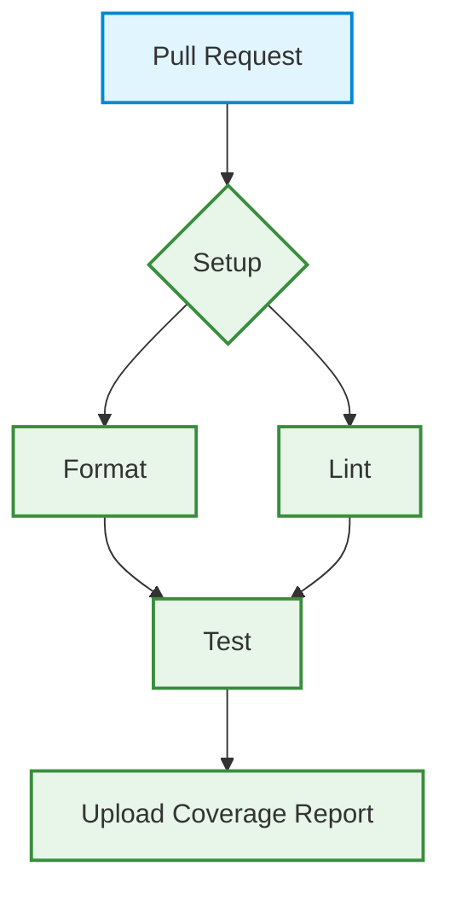

# DevOps
- Descrizione del flusso di sviluppo (git flow, convenzioni di commit, branch).
- Automazione: script npm, build, serve, test.
- Containerizzazione (Docker, docker-compose).
- CI/CD: pipeline GitHub Actions, SonarCloud, semantic-release.
- Eventuali diagrammi di pipeline, screenshot di configurazioni, esempi di file di configurazione.

---
# DevOps

Questo capitolo descrive le pratiche e gli strumenti DevOps adottati nel progetto Keyla-TTT per garantire un flusso di sviluppo efficiente, automatizzato e di alta qualità, dalla scrittura del codice al deployment.

## 1. Flusso di Sviluppo

Il progetto adotta un flusso di lavoro basato su GitFlow per gestire lo sviluppo del codice in modo strutturato.

-   **Branch Principali**:
    -   `main`: Contiene il codice di produzione stabile. Ogni commit su questo branch rappresenta una nuova versione rilasciata.
    -   `develop`: È il branch di integrazione principale per le nuove funzionalità. Una volta che le funzionalità sono stabili, vengono unite in `main` per un nuovo rilascio.
-   **Branch di Supporto**:
    -   `feature/*`: Le nuove funzionalità vengono sviluppate in branch dedicati che partono da `develop` (es. `feature/analytics`). Una volta completate, vengono unite nuovamente in `develop` tramite una Pull Request.
-   **Convenzioni di Commit**: Si raccomanda l'uso dei **Conventional Commits**. Questo standard non solo migliora la leggibilità della cronologia di Git, ma è anche fondamentale per l'automazione del versioning e la generazione del changelog tramite `semantic-release`.

## 2. Automazione e Qualità del Codice

Per mantenere un'alta qualità del codice e automatizzare le attività ripetitive, il progetto utilizza diversi strumenti.

-   **Build Tool (SBT)**: SBT è lo strumento di build per il backend Scala. Gestisce la compilazione, l'esecuzione dei test, la gestione delle dipendenze e l'esecuzione di task personalizzati.
-   **Hook di Pre-commit**: Prima di ogni commit, uno script di pre-commit (configurato in `build.sbt`) viene eseguito automaticamente. Questo script:
    1.  Controlla la formattazione del codice Scala con `scalafmt`.
    2.  Esegue l'analisi statica con `scalafix`.
    3.  In caso di problemi, tenta di correggerli automaticamente e aggiunge i file modificati al commit. Questo garantisce che solo codice conforme agli standard venga inserito nel repository.

## 3. Containerizzazione

L'applicazione e i suoi servizi dipendenti sono containerizzati per garantire coerenza tra gli ambienti di sviluppo, test e produzione.

-   **Docker**: Viene utilizzato un `Dockerfile` per creare un'immagine dell'applicazione Scala, includendo tutte le dipendenze necessarie per la sua esecuzione.
-   **Docker Compose**: Per l'ambiente di sviluppo locale, un file `docker-compose.yml` orchestra l'avvio dell'applicazione e dei servizi di supporto, come il database MongoDB, con un singolo comando.

## 4. CI/CD con GitHub Actions

Il progetto si avvale di una pipeline di Integrazione Continua e Deployment Continuo (CI/CD) implementata con GitHub Actions. La pipeline viene attivata ad ogni Pull Request verso i branch `develop` e `main`.

### Pipeline di CI

La pipeline di Integrazione Continua è definita nel file `.github/workflows/scala.yml` e si compone dei seguenti job:

1.  **Setup**: Installa le dipendenze e le mette in cache per accelerare le esecuzioni successive.
2.  **Format**: Verifica che tutto il codice sia formattato correttamente eseguendo `sbt scalafmtCheckAll`.
3.  **Lint**: Esegue un'analisi statica del codice per individuare potenziali bug o "code smells" tramite `sbt "scalafixAll --check"`.
4.  **Test**: Esegue la suite di test unitari e di integrazione, generando un report di code coverage. Il report viene poi caricato come artefatto per poter essere analizzato.

### Diagramma della Pipeline



### File di Configurazione della Pipeline

Di seguito è riportato il contenuto del file di configurazione della pipeline di GitHub Actions.

```yaml
# .github/workflows/scala.yml
name: Scala CI

on:
  workflow_dispatch:
  pull_request:
    branches: [ "develop", "main" ]

permissions:
  contents: read

jobs:
  setup:
    runs-on: ubuntu-latest
    outputs:
      cache-hit: ${{ steps.cache.outputs.cache-hit }}
    steps:
      - uses: actions/checkout@v4
      - uses: sbt/setup-sbt@v1
      - name: Cache sbt
        id: cache
        uses: actions/cache@v4
        with:
          path: |
            ~/.sbt
            ~/.ivy2/cache
            ~/.coursier/cache
          key: ${{ runner.os }}-sbt-${{ hashFiles('**/*.sbt') }}
          restore-keys: ${{ runner.os }}-sbt-

  format:
    runs-on: ubuntu-latest
    needs: setup
    steps:
      - uses: actions/checkout@v4
      - uses: sbt/setup-sbt@v1
      - name: Restore sbt cache
        # ... (cache restore steps)
      - name: Set up JDK 21
        uses: actions/setup-java@v4
        with:
          java-version: '21'
          distribution: 'temurin'
          cache: 'sbt'
      - name: Check formatting
        run: sbt scalafmtCheckAll

  lint:
    runs-on: ubuntu-latest
    needs: setup
    steps:
      - uses: actions/checkout@v4
      - uses: sbt/setup-sbt@v1
      - name: Restore sbt cache
        # ... (cache restore steps)
      - name: Set up JDK 21
        uses: actions/setup-java@v4
        with:
          java-version: '21'
          distribution: 'temurin'
          cache: 'sbt'
      - name: Run scalafix
        run: sbt "scalafixAll --check"

  test:
    runs-on: ubuntu-latest
    needs: [ format, lint ]
    steps:
      - uses: actions/checkout@v4
      - uses: sbt/setup-sbt@v1
      - name: Restore sbt cache
        # ... (cache restore steps)
      - name: Set up JDK 21
        uses: actions/setup-java@v4
        with:
          java-version: '21'
          distribution: 'temurin'
          cache: 'sbt'
      - name: Run tests with coverage
        run: sbt clean coverage test coverageReport
      - name: Upload coverage report
        uses: actions/upload-artifact@v4
        with:
          name: coverage-report
          path: target/scala-*/scoverage-report
```

### Analisi Continua e Versioning

-   **SonarCloud**: Integrato nella pipeline, SonarCloud esegue un'analisi approfondita del codice ad ogni Pull Request, controllando vulnerabilità di sicurezza, bug, code smells e code coverage, fornendo un feedback diretto agli sviluppatori.
-   **Semantic Release**: Al momento del merge su `main`, un'azione di `semantic-release` analizza i messaggi di commit, determina automaticamente la nuova versione del software secondo le regole del Semantic Versioning, genera un changelog e crea una nuova release su GitHub.