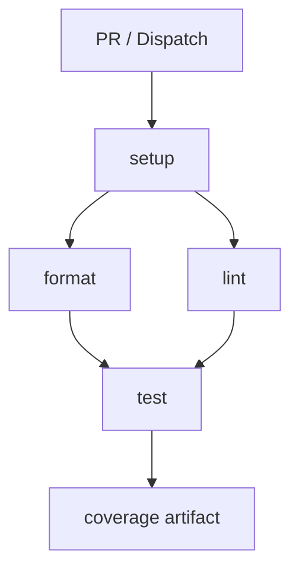
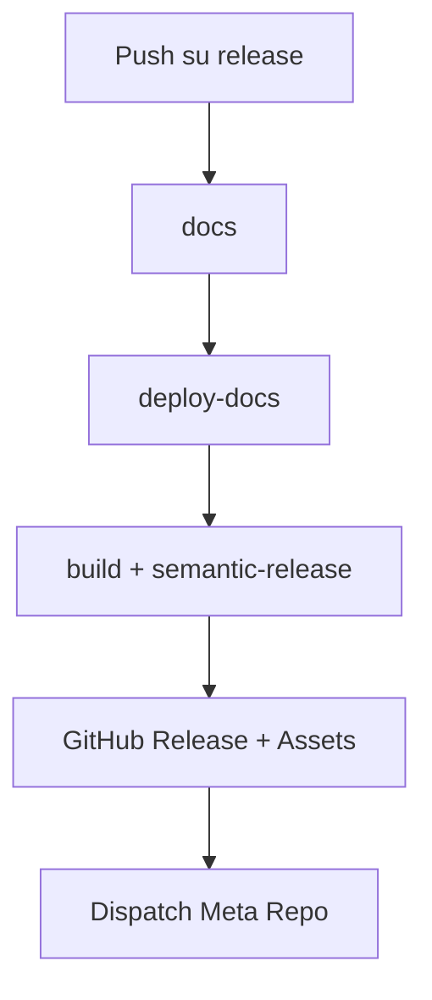
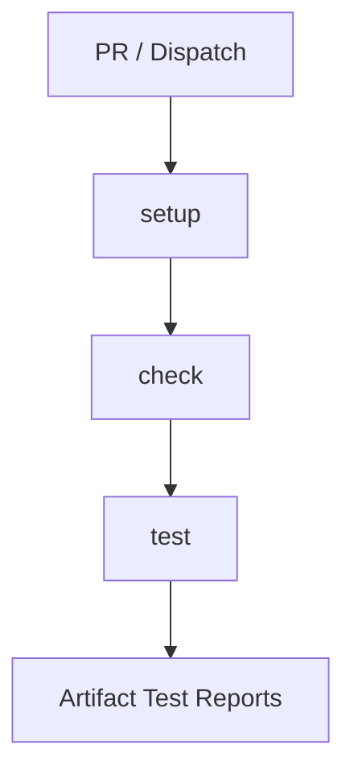
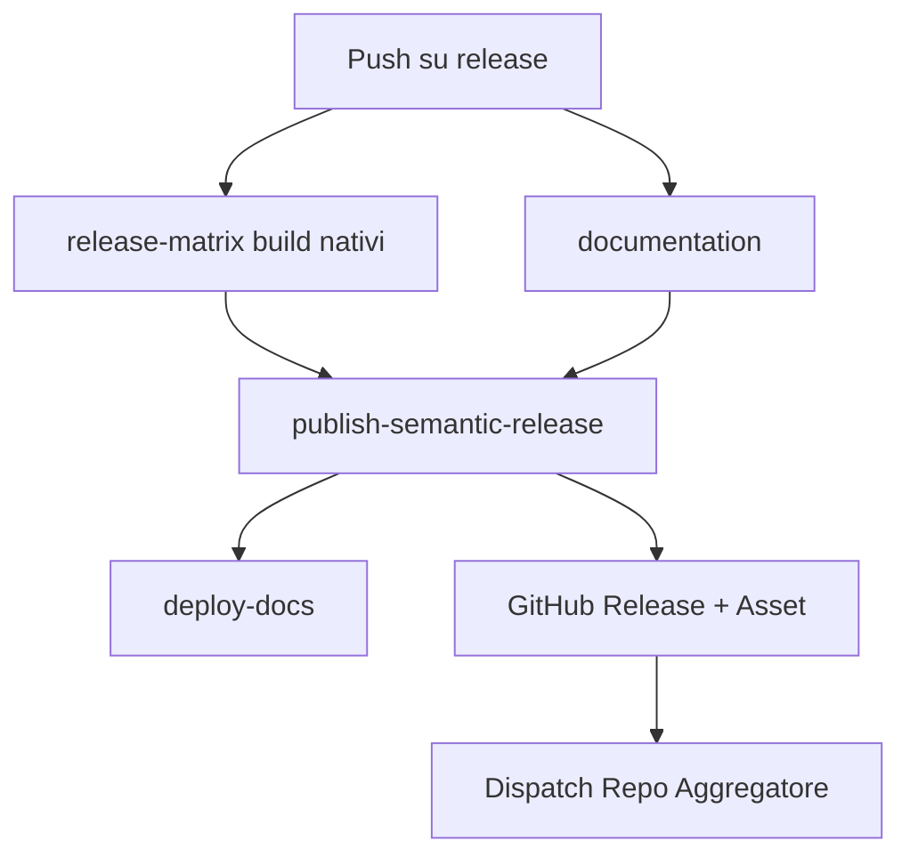
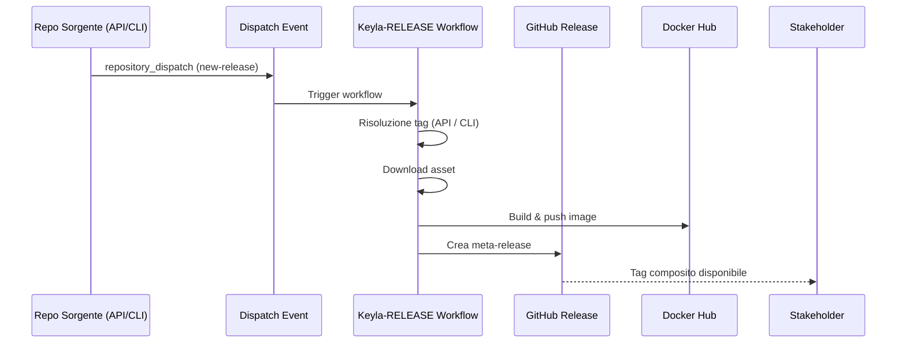

## 4. CI/CD con GitHub Actions (API - Scala)

### 4.1.1 Panorama dei Workflow
| Workflow | File | Trigger | Scopo sintetico |
|----------|------|---------|-----------------|
| CI Scala | `\.github/workflows/scala.yml` | `pull_request` (verso `develop`,`main`), `workflow_dispatch` | Validazioni qualità (format, lint, test, coverage) |
| Sync Release Branch | `\.github/workflows/push_on_release.yml` | `push` / PR chiusa su `main`, manuale | Allinea `release` a `main` |
| Semantic Release + Docs | `\.github/workflows/release.yml` | `push` su `release`, manuale | Genera docs, pubblica Pages, crea release + asset |

---

### 4.1.2 Workflow CI (`scala.yml`)
Obiettivo: impedire l’ingresso in `develop` / `main` di codice non formattato, non conforme o con test rotti.

Trigger:
- `pull_request`: garantisce feedback precoce sulle modifiche destinate a rami principali.
- `workflow_dispatch`: esecuzione manuale per verifiche spot.

Jobs (ordine logico):

#### Job: `setup`
Funzione: prepara ambiente e popola cache per velocizzare i job successivi.  
Passi principali:
- Checkout: recupera il codice.
- `sbt/setup-sbt`: abilita wrapper e configurazioni SBT.
- Cache (cartelle `~/.sbt`, `~/.ivy2/cache`, `~/.coursier/cache`): riduce tempi di download dipendenze.
- Output `cache-hit`: può essere usato per logiche condizionali future (non ancora sfruttato).

#### Job: `format` (dipende da `setup`)
Scopo: bloccare codice non formattato.  
Passi:
- Restore cache (ripete per isolamento del job).
- Setup JDK 21 (distribuzione Temurin) con cache integrata.
- Esegue `sbt scalafmtCheckAll`: fallisce se anche un solo file non è conforme.

#### Job: `lint` (dipende da `setup`)
Scopo: controllo statico.  
Passi:
- Setup analogo a `format`.
- Esegue `sbt "scalafixAll --check"`: verifica regole di refactoring e qualità. Non modifica i file (modalità check).

#### Job: `test` (dipende da `format` e `lint`)
Scopo: validazione funzionale + coverage.  
Passi:
- Setup ambiente (checkout + cache).
- `sbt clean coverage test coverageReport`:
    - `coverage`: attiva strumentazione.
    - `test`: esegue suite.
    - `coverageReport`: genera report (es. scoverage).
- Upload artifact (cartella `target/scala-*/scoverage-report`): rende disponibile il report per consultazione / aggregazione futura.

Note operative e possibili estensioni interne alla sezione (non nuovi paragrafi):
- Aggiungibile un job `sonar` dopo `test` (`needs: test`).
- Aggiungere `concurrency: { group: ci-${{ github.ref }}, cancel-in-progress: true }` per evitare esecuzioni duplicate su PR aggiornate.
- Inseribile soglia coverage (`sbt coverageAggregate` + parsing) per fallire sotto un limite.

Diagramma:


---

### 4.1.3 Workflow Sync Branch (`push_on_release.yml`)
Obiettivo: mantenere `release` come riflesso immediato e controllato di `main`, separando l’atto di pubblicazione (che avviene solo su `release`).

Trigger:
- `push` su `main`: ogni aggiornamento stabile.
- `pull_request` chiusa verso `main`: copre merge via PR.
- `workflow_dispatch`: fallback manuale.

Job: `update-release-branch`  
Passi:
- Checkout con `fetch-depth: 0` (serve la storia completa in caso di future analisi o tag).
- Configurazione identità Git (necessaria per push).
- `git checkout -B release`: crea o riallinea branch locale.
- `git push --force`: garantisce identità tra `main` e `release` (scelta consapevole: sovrascrive divergenze).
- Notifica testuale (log di auditing).

Rischio noto: perdita di commit manuali su `release` (devono essere evitati per policy).

---

### 4.1.4 Workflow Release + Documentazione (`release.yml`)
Obiettivo: pipeline integrata di documentazione, pubblicazione della versione e distribuzione artefatti.

Trigger:
- `push` su `release`: solo dopo riallineamento da `main`.
- `workflow_dispatch`: rilancio manuale (es. in caso di fix su configurazioni).

Permissions:
- `contents: write`: tag + release + eventuali commit (changelog).
- `pages: write` + `id-token: write`: distribuzione GitHub Pages sicura (OIDC).

Jobs (pipeline sequenziale):

#### Job: `docs`
Scopo: generare documentazione API (Scaladoc).  
Passi:
- Checkout + setup SBT + cache dipendenze.
- JDK 21 (coerente con build principale).
- `sbt doc`: genera documentazione in `target/scala-*/api`.
- Copia in struttura piatta (`docs-to-deploy`) per conformità a Pages.
- Artifact upload (`api-documentation`): passaggio inter-job affidabile.

#### Job: `deploy-docs` (needs: `docs`)
Scopo: pubblicazione su GitHub Pages.  
Passi:
- Download artifact (isolamento: non richiede ricostruzione).
- Log diagnostico (listing file).
- `actions/configure-pages`: prepara ambiente.
- Upload artifact dedicato a Pages.
- Deploy con `actions/deploy-pages`: espone URL (esportato come output `page_url`).

#### Job: `release` (needs: `deploy-docs`)
Scopo: creare release versionata con asset binari.  
Passi:
- Checkout intero (storia necessaria per semantic-release).
- Setup SBT + cache.
- Build pacchetto distributivo: `sbt Universal/packageBin` → ZIP in `target/universal`.
- Setup Node (ambiente tool di rilascio).
- Installazione dipendenze `semantic-release` (plugin core: analyzer, notes, git, github).
- Preparazione cartella `release-assets`.
- Copia ZIP dentro `release-assets` (sarà allegato).
- Config Git (necessario se plugin `@semantic-release/git` aggiorna `CHANGELOG.md`).
- Esecuzione `npx semantic-release`:
    - Analizza commit (Conventional Commits).
    - Determina tipo di versione (major/minor/patch).
    - Genera changelog.
    - Crea tag + GitHub Release.
    - Allegare asset (richiede config file con `assets`).
- Dispatch verso repository `Keyla-RELEASE` (evento `new-release`) per orchestrazioni esterne/aggregazioni future.
    - Usa `PAT_TOKEN` (scope repo) perché `GITHUB_TOKEN` non può dispatchare cross-repo in alcuni casi di restrizione.

Diagramma:


Nota: eventuali failure in `deploy-docs` bloccano la pubblicazione (consistenza docs-versione).

---

### 4.1.5 Semantic Release: Regole e Mappature
Logica di bump automatico:
- `feat:` → minor
- `fix:` / `perf:` → patch
- `refactor:` / `docs:` / `chore:` / `test:` / `style:` → nessun bump (se senza `BREAKING CHANGE`)
- Presenza di testo `BREAKING CHANGE:` (o `!` nel tipo) → major

Prerequisiti qualitativi:
- Commit lint (pre-merge) per evitare messaggi non conformi.
- Evitare push diretti su `release` (solo sync automatica).

---

### 4.1.6 Checklist Operativa
- \[ \] Conventional Commits applicati su tutte le PR
- \[ \] Protezione branch `main` / `release`
- \[ \] Coverage minima definita e verificata
- \[ \] (Opzionale) Analisi SonarCloud integrata post-test
- \[ \] Artifact ZIP presente e allegato nelle release
- \[ \] Docs pubblicate contestualmente alla versione
- \[ \] Evento `repository-dispatch` ricevuto correttamente dal repo aggregatore
- \[ \] Changelog generato automaticamente senza conflitti di merge

---

### 4.1.7 Sintesi
Il modello separa chiaramente:
- Validazione continua (CI su PR)
- Stabilizzazione (`main`)
- Pubblicazione controllata (`release`)
- Distribuzione documentazione + asset coerenti con la versione

- Questa stratificazione riduce rischi (release premature), incrementa tracciabilità e facilita l’estensione futura ad altri componenti (CLI, meta-release) senza modificare il core del flusso esistente. del merge su `main`, un'azione di `semantic-release` analizza i messaggi di commit, determina automaticamente la nuova versione del software secondo le regole del Semantic Versioning, genera un changelog e crea una nuova release su GitHub.


### 4.2.1 Panorama dei Workflow (Keyla-CLI)
| Workflow | File | Trigger | Scopo sintetico |
|----------|------|---------|-----------------|
| CI Kotlin | `.github/workflows/kotlin.yml` | `pull_request` (verso `develop`,`main`), `workflow_dispatch` | Verifica formato, lint (se previsto nel task), test JVM |
| Sync Release Branch | `.github/workflows/push_on_release.yml` | `push` / PR chiusa su `main`, manuale | Allinea `release` a `main` (precondizione rilascio) |
| Semantic Release + Binaries + Docs | `.github/workflows/release.yml` | `push` su `release`, manuale | Build eseguibili Native (Linux/macOS ARM/Windows), genera Dokka, crea release GitHub con asset, pubblica Docs |

---

### 4.2.2 Workflow CI (`kotlin.yml`)
Obiettivo: bloccare l’ingresso di codice Kotlin non conforme o con test rotti nei branch principali.

Trigger:
- `pull_request`: feedback anticipato su modifiche destinate a `develop` / `main`.
- `workflow_dispatch`: esecuzione manuale (verifica locale di uno stato corrente).

Jobs (ordine logico):

#### Job: `setup`
Funzione: prepara JDK 21 e popola cache Gradle (`~/.gradle/caches`, wrapper).  
Passi:
- Checkout
- `actions/setup-java` (Temurin 21) con cache Gradle integrata
- Cache esplicita (ridondante ma pronta a riuso esteso)
- Output `cache-hit` (potenziale gating futuro)

#### Job: `check` (needs: `setup`)
Scopo: controllo qualità (format, lint aggregati nel task `ciCheckCode`).  
Passi:
- Ripristino cache (isolamento)
- Esecuzione `./gradlew ciCheckCode` (può includere: Ktlint, Detekt, formatting check, ecc.)

#### Job: `test` (needs: `check`)
Scopo: esecuzione test JVM (modulo comune).  
Passi:
- Setup identico
- `./gradlew jvmTest`
- Upload report in `build/reports/tests/` come artifact (`test-results`)

Possibili estensioni:
- Aggiungere test Native / JS (`allTests` se configurato)
- Coverage con Kover (`./gradlew koverXmlReport`) + soglia
- SonarCloud dopo test
- Concurrency:
  ```yaml
  concurrency:
    group: ci-${{ github.ref }}
    cancel-in-progress: true
  ```

Diagramma:


---

### 4.2.3 Workflow Sync Branch (`push_on_release.yml`)
Obiettivo: riflettere lo stato stabile di `main` in `release` (fonte unica per generazione binari e versioning).

Trigger:
- `push` su `main`
- `pull_request` chiusa verso `main`
- `workflow_dispatch`

Job: `update-release-branch`
Passi chiave:
- Checkout completo (`fetch-depth: 0`)
- Config Git bot
- `git checkout -B release`
- `git push --force` (garantisce identità, elimina divergenze)
- Log di esito

Rischio: sovrascrittura di commit manuali su `release` (vietati per policy).

Mitigazioni future:
- Protezione branch `release` (no push diretto)
- Audit via log GitHub Actions

---

### 4.2.4 Workflow Release + Documentazione (`release.yml`)
Obiettivo: pipeline integrata per:
1. Build eseguibili nativi Keyla-CLI (Kotlin/Native)
2. Generazione Dokka
3. Pubblicazione Release GitHub con asset multipiattaforma
4. Deploy documentazione su GitHub Pages
5. Dispatch verso repository esterno aggregatore

Trigger:
- `push` su `release`
- `workflow_dispatch`

Struttura principale dei job:

#### Job: `release` (matrix build)
Funzione: produce binari nativi.  
Matrix:
- Linux (`linuxX64` → `keyla-linux`)
- macOS ARM (`macosArm64` → `keyla-macos-arm64`)
- Windows (`mingwX64` → `keyla-windows.exe`)

Passi salienti:
- Install dipendenze native (apt / brew curl)
- Cache compiler Kotlin/Native (`~/.konan`)
- `./gradlew linkReleaseExecutable<Arch>`
- Rinomina output (`Keyla.kexe` / `Keyla.exe`) in nomi uniformi
- Upload artifact per OS (isolamento)

Ottimizzazioni possibili:
- Aggiungere checksum (`sha256sum`) e upload
- Firma (codesign / sigstore) prima dell’upload
- Estendere matrix a `macosX64` se richiesto (retrocompatibilità Intel)

#### Job: `documentation`
Funzione: generare documentazione API con Dokka.  
Passi:
- Checkout
- JDK 21
- `./gradlew dokkaHtml`
- Upload artifact `dokka-documentation`

#### Job: `publish` (needs: `release`, `documentation`)
Funzione: orchestrare semantic-release e allegare asset.  
Passi:
- Download di tutti gli artifact (binari + docs)
- Install plugin `semantic-release` (commit analyzer, notes, changelog, git, gitHub)
- List diagnostico degli artifact (debug)
- `npx semantic-release --extends ./release.config.js`
    - Determina versione
    - Aggiorna changelog
    - Crea tag + Release
    - Allegare asset (config in `release.config.js`)
- Dispatch verso repo esterno (`repository-dispatch`) con token personale (`PAT_TOKEN`)

#### Job: `deploy-docs` (needs: `publish`)
Funzione: pubblicare le pagine generate.  
Passi:
- Download artifact `dokka-documentation`
- Deploy su branch `gh-pages` (`JamesIves/github-pages-deploy-action@v4`)

Diagramma:


Considerazioni di consistenza:
- Docs pubblicate solo dopo successo release (ordine controllato)
- Artifacts centralizzati prima di semantic-release per evitare race

---

### 4.2.5 Semantic Release: Regole e Mappature (Keyla-CLI)
Strategia invariata rispetto alla sezione 4.1.5 (Conventional Commits):
- `feat:` → minor
- `fix:` / `perf:` → patch
- `BREAKING CHANGE:` o `!` → major
- Altri tipi (`chore`, `docs`, `refactor`, `style`, `test`) → nessun bump (salvo breaking)
  Estensioni plausibili:
- Mapping personalizzato per `build:` (patch)
- Pre-release su branch dedicati (`beta`, `next`) con canali separati

Prerequisiti:
- Commit lint obbligatorio
- Evitare squash manuali non conformi
- Allineare `release.config.js` con elenco asset (pattern: `dist/native-*/keyla-*`)

---

### 4.2.6 Checklist Operativa (Keyla-CLI)
- \[ \] Branch `release` aggiornato automaticamente da `main`
- \[ \] Conventional Commits rispettati
- \[ \] Protezione branch (`main`, `release`, `gh-pages`)
- \[ \] Binari presenti per Linux / macOS ARM / Windows
- \[ \] (Opz.) Checksum e/o firma artefatti inclusi
- \[ \] Changelog aggiornato senza conflitti
- \[ \] Dokka pubblicata su Pages (ultima versione)
- \[ \] Evento `repository-dispatch` ricevuto dal repo esterno
- \[ \] (Opz.) Test eseguibili anche in Native/JS (integrazione futura)
- \[ \] (Opz.) Metriche coverage con Kover
- \[ \] (Opz.) Pipeline fail se artifact mancante

---

### 4.2.7 Sintesi
La pipeline Keyla-CLI combina:
- Validazione continua (CI Kotlin)
- Branch di stabilizzazione (`main`)
- Branch di pubblicazione (`release`) sincronizzato in modo deterministico
- Build multi\-piattaforma nativa (Kotlin/Native)
- Versionamento automatico con Semantic Versioning
- Distribuzione documentazione (Dokka) coerente con la release
- Automazione di rilascio esteso tramite `repository-dispatch`

Questo modello garantisce ripetibilità, riduce l’errore manuale, isola fallimenti (build, docs, publish) e abilita estensioni future (firma binari, canali pre-release, supply chain security) senza ristrutturare l’impianto esistente.


### 4.3.1 Keyla-RELEASE: Scopo e Ruolo
Repository di orchestrazione finale che:
- Aggrega versioni coordinate di Keyla-API e Keyla-CLI
- Produce un tag composito unico (meta-release)
- Costruisce e pubblica un'immagine Docker unificata
- Espone un singolo punto di consumo per integrazioni esterne

---

### 4.3.2 Flusso di Aggiornamento (`update-release-repo.yml`)
Workflow nel file `\.github/workflows/update-release-repo.yml`.

Trigger:
- `repository_dispatch` (tipo `new-release`) inviato dai repo sorgente (API o CLI)
- `workflow_dispatch` manuale (con override opzionale dei tag)
  Funzione: risolvere i tag più recenti, scaricare gli asset, costruire immagine Docker, creare meta-release.

---

### 4.3.3 Risoluzione dei Tag
Logica:
1. Evento da API → usa `api_release_tag` del payload e risolve ultimo tag CLI
2. Evento da CLI → usa `cli_release_tag` del payload e risolve ultimo tag API
3. Esecuzione manuale → entrambi default `latest` (risolti via `gh release view`)
4. Convalida: se uno dei due tag manca il workflow fallisce (fail-fast)

Output:
- `api_tag`
- `cli_tag`
- Tag finale meta-release: `v<api_version>.<cli_version>` (rimozione prefisso `v` dai singoli e concatenazione)

Esempio: API `v1.6.0`, CLI `v1.2.0` → meta: `v1.6.0.1.2.0`

---

### 4.3.4 Costruzione e Pubblicazione
Passi principali:
1. Download asset API (`*.zip`) e CLI (`keyla-*`)
2. Normalizzazione directory `release-assets`
3. Build Docker (Buildx) con tag: `<dockerhub_user>/keyla-release:v<api>.<cli>`
4. Creazione GitHub Release:
    - Body descrittivo (componenti inclusi)
    - Collegamento all'immagine Docker

---

### 4.3.5 Diagramma Operativo

---

### 4.3.6 Gestione Errori e Recovery
- Mancato fetch tag (rate limit / token): ripetere via `workflow_dispatch`
- Fallimento build Docker: ri-lanciare manualmente dopo fix Dockerfile
- Incongruenza tag (es. API rimossa): eliminare meta-release e rilanciare con override input
- Asset mancanti: blocco esplicito prima della fase Docker (verifica lista file)

---

### 4.3.7 Sicurezza e Token
- `GITHUB_TOKEN`: usato per `gh release view` e download asset
- `PAT_TOKEN`: consigliato se futuro dispatch inverso o cross-org
- `DOCKERHUB_TOKEN`: privilegi limitati al push repository dedicato
- Evitare inserimento diretto di tag utente non validati (già mitigato da lookup reale)

---

### 4.3.8 Checklist Meta-Release
- \[ \] Evento `repository_dispatch` ricevuto
- \[ \] Tag API risolto correttamente
- \[ \] Tag CLI risolto correttamente
- \[ \] Asset scaricati in `release-assets`
- \[ \] Immagine Docker pubblicata con tag composito
- \[ \] Release GitHub creata con riferimenti coerenti
- \[ \] Nessun tag duplicato precedentemente esistente
- \[ \] Log di risoluzione tag pulito (no fallback silenziosi)

---

### 4.3.10 Sintesi
Keyla-RELEASE fornisce un livello di astrazione che consolida lo stato versionato dell’ecosistema (API + CLI) in un singolo artefatto consumabile (Docker + meta-release), riducendo ambiguità e centralizzando la distribuzione. Il tag composito funge da snapshot coerente e tracciabile dell’intera piattaforma.