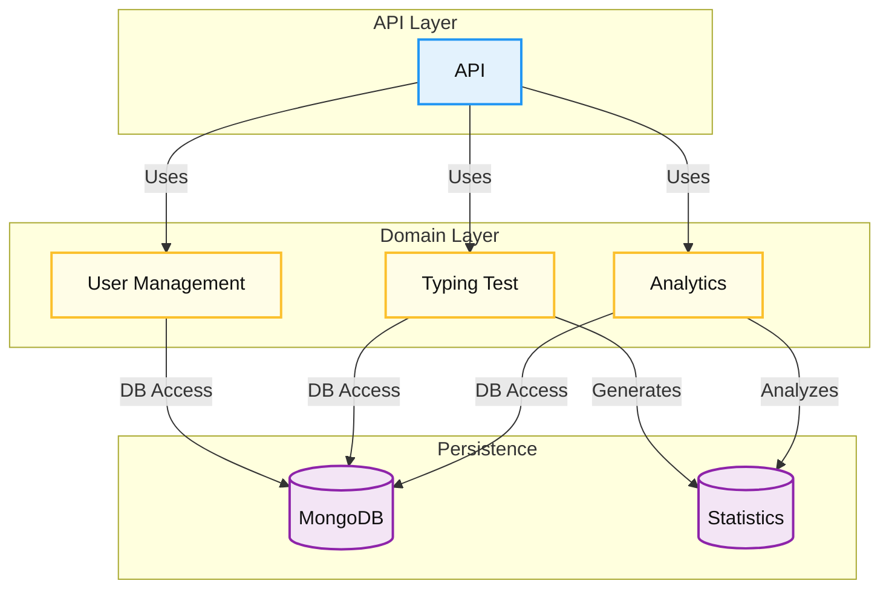
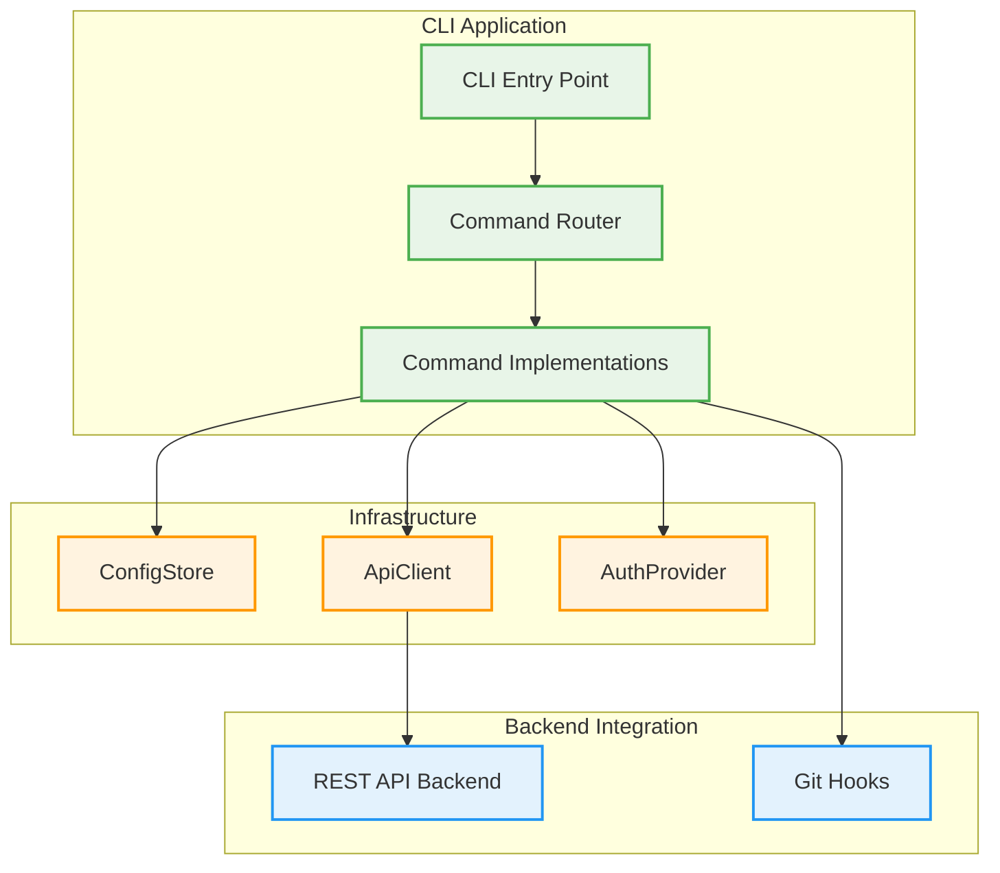

# Implementation

This chapter describes the main software components, the technologies used, the core classes and services of the Keyla-TTT project, also providing code examples and diagrams illustrating the dependencies between the various modules.

## 1. Software Components

The Keyla-TTT project is structured into the following main components:

- **Backend**: Implemented in Scala using SBT as the build tool, it exposes RESTful APIs and manages business logic.
- **Database**: MongoDB is used for persistent storage of users, test results, and analytical data.

## 2. Technologies Used

- **Scala 3**: Main programming language for the backend.
- **SBT**: Build tool for compiling and managing Scala project dependencies.
- **MongoDB**: NoSQL database for data persistence.
- **Docker**: For containerizing the application and its dependencies.
- **Play Framework**: Web framework for implementing RESTful APIs (inferred from the project structure).

## 3. Main Modules

### 3.1 User Management

Handles user registration, authentication, and profile management.

#### Main Classes

- `User`: Represents a user entity with attributes such as username, email, and password.
- `UserRepository`: Manages CRUD operations for users.
- `AuthService`: Handles authentication and JWT token generation.

#### Code Example

```scala
// User model
case class User(
  id: String,
  username: String,
  email: String,
  passwordHash: String,
  createdAt: Long
)

// User repository
trait UserRepository {
  def findById(id: String): Option[User]

  def findByUsername(username: String): Option[User]

  def insert(user: User): User

  def update(user: User): Option[User]

  def delete(id: String): Boolean
}
```

### 3.2 Typing Test

Manages the logic for typing tests, including test generation and result evaluation.

#### Main Classes

- `TypingTest`: Represents a typing test session.
- `TypingTestService`: Manages test creation and result validation.
- `TextRepository`: Provides texts for typing tests.

#### Code Example

```scala
// TypingTest model
case class TypingTest(
  id: String,
  text: String,
  difficulty: String,
  duration: Int,
  createdAt: Long
)

// Typing test service
class TypingTestService(textRepo: TextRepository){
  def generateTest(difficulty: String, duration: Int): TypingTest = {
    val text = textRepo.getRandomText(difficulty)
    TypingTest(
      id = UUID.randomUUID().toString,
      text = text,
      difficulty = difficulty,
      duration = duration,
      createdAt = System.currentTimeMillis()
    )
  }
}
```

### 3.3 Analytics

Collects and analyzes user performance data.

#### Main Classes

- `Statistics` (trait): Defines the structure for statistics.
- `UserStatistics`: Concrete implementation for user test results.
- `AnalyticsService`: Aggregates and analyzes statistics.

#### Code Example

```scala
// Already present in Statistics.scala
trait Statistics {
  /** Unique identifier of the user */
  def userId: String

  /** Unique identifier of the test */
  def testId: String

  /** Words per minute (WPM) calculated from the typing speed */
  def wpm: Double

  /** Accuracy percentage of the typed text compared to the target text */
  def accuracy: Double

  /** List of errors made during the typing test */
  def errors: List[Int]

  /** Timestamp of when the statistics were recorded */
  def timestamp: Long

  def copy(): Statistics
}
// Analytics service
class AnalyticsService(statsRepo: StatisticsRepository){
  def getUserPerformanceHistory(userId: String): List[UserStatistics] =
    statsRepo.findByUserId(userId)

  def calculateUserProgress(userId: String): ProgressMetrics = {
    val stats = getUserPerformanceHistory(userId)
    // Logic to calculate user progress
    ProgressMetrics()
  }
}
```

### 3.4 API

Exposes RESTful endpoints for communication with the frontend.

#### Main Classes

- `UserController`: Manages user-related API endpoints.
- `TypingTestController`: Manages typing test endpoints.
- `AnalyticsController`: Provides analytical data.

#### Code Example

```scala
// User controller
class UserController(userService: UserService, authService: AuthService) {
  def register = Action(parse.json) { request =>
    // Registration logic
    Ok(Json.obj("message" -> "User registered successfully"))
  }

  def login = Action(parse.json) { request =>
    // Login logic
    Ok(Json.obj("token" -> generatedToken))
  }
}
// Typing test controller
class TypingTestController(testService: TypingTestService) {
  def generateTest(difficulty: String, duration: Int) = Action {
    val test = testService.generateTest(difficulty, duration)
    Ok(Json.toJson(test))
  }

  def submitResult = Action(parse.json) { request =>
    // Logic to save and evaluate results
    Ok(Json.obj("message" -> "Test results submitted"))
  }
}
```

## 4. Module Dependency Diagram



## 5. Summary

The Keyla-TTT project is modularly structured with a clear separation between user management, typing test logic, analytics, and API layers. The use of Scala, MongoDB, and functional programming techniques ensures a scalable and maintainable architecture, while the container-based approach simplifies deployment.

Ecco la sezione 6 riscritta in inglese (sintetica e senza ripetere i blocchi di codice già forniti).

## 6. CLI Implementation

This section describes the implementation of the Keyla-TTT CLI component, extending the existing backend API architecture to provide a command-line interface for users and developers.

### 6.1 Overview and Objectives

The CLI component serves as a client-side application that interacts with the Keyla-TTT backend APIs, providing:

- Command-line interface for user authentication and typing tests
- Analytics retrieval and display functionality
- Configuration management for API endpoints and user credentials
- Git hooks integration for development workflow automation
- Cross-platform support with Windows-specific optimizations

### 6.2 Technologies Used (CLI)

- **Kotlin 1.x**: Main programming language for CLI implementation
- **Gradle**: Build tool with `application` plugin for distribution
- **Picocli**: Command-line parsing framework with subcommand support
- **Ktor Client**: HTTP client for API communication
- **kotlinx-serialization**: JSON serialization for configuration and API data
- **JLine**: Optional terminal enhancement library

### 6.3 Architecture and Main Classes

The CLI follows a modular architecture with clear separation of concerns:

#### 6.3.1 Command Infrastructure

**KeylaCommand** - Main entry point and command router

```kotlin
@Command(
    name = "keyla",
    description = ["Keyla-TTT CLI"],
    mixinStandardHelpOptions = true,
    subcommands = [
        LoginCommand::class,
        TestRunCommand::class,
        AnalyticsShowCommand::class,
        ConfigShowCommand::class,
        HooksInstallCommand::class
    ]
)
class KeylaCommand : Runnable {
    override fun run() {
        CommandLine(this).usage(System.out)
    }
}
```

#### 6.3.2 Configuration Management

**ConfigStore** - Handles persistent configuration storage

```kotlin
@Serializable
data class CliConfig(
    val baseUrl: String = "http://localhost:9000",
    val token: String? = null
)

class ConfigStore {
    private val configFile = Path.of(System.getProperty("user.home"))
        .resolve(".keyla")
        .resolve("config.json")

    fun load(): CliConfig {
        if (!configFile.exists()) return CliConfig().also { save(it) }
        return Json.decodeFromString(configFile.readText())
    }

    fun save(config: CliConfig) {
        configFile.parent.createDirectories()
        configFile.writeText(Json.encodeToString(config))
    }
}
```

#### 6.3.3 API Communication

**ApiClient** - HTTP client with authentication support

```kotlin
class ApiClient(private val config: CliConfig) {
    private val client = HttpClient(CIO) {
        install(ContentNegotiation) { 
            json(Json { ignoreUnknownKeys = true }) 
        }
        defaultRequest {
            url(config.baseUrl)
            config.token?.let { 
                header(HttpHeaders.Authorization, "Bearer $it") 
            }
        }
    }

    suspend inline fun <reified T> get(path: String): T =
        client.get(path).body()

    suspend inline fun <reified Req, reified Res> post(path: String, body: Req): Res =
        client.post(path) { setBody(body) }.body()
}
```

### 6.4 Core Commands Implementation

#### 6.4.1 Authentication Command

```kotlin
@Command(name = "login", description = ["Authenticate user and save token"])
class LoginCommand : Runnable {
    @Option(names = ["--user"], required = true)
    lateinit var username: String

    @Option(names = ["--password"], required = true, interactive = true)
    lateinit var password: String

    override fun run() = runBlocking {
        val store = ConfigStore()
        val config = store.load()
        val api = ApiClient(config)

        val response = api.post<LoginRequest, LoginResponse>(
            "/api/v1/auth/login", 
            LoginRequest(username, password)
        )
        
        store.save(config.copy(token = response.token))
        println("Authentication successful. Token saved.")
    }
}
```

#### 6.4.2 Typing Test Command

```kotlin
@Command(name = "test", description = ["Run typing test"])
class TestRunCommand : Runnable {
    @Option(names = ["--difficulty"], defaultValue = "normal")
    lateinit var difficulty: String

    @Option(names = ["--duration"], defaultValue = "60")
    var duration: Int = 60

    override fun run() = runBlocking {
        val config = ConfigStore().load()
        val api = ApiClient(config)

        // Generate test
        val test = api.post<GenerateTestRequest, TypingTestDto>(
            "/api/v1/tests/generate",
            GenerateTestRequest(difficulty, duration)
        )

        println("Test ID: ${test.id}")
        println("Difficulty: ${test.difficulty}")
        println("Duration: ${test.duration}s")
        println("\nText to type:\n${test.text}")

        // Submit result (simplified for demonstration)
        val result = SubmitResultRequest(
            testId = test.id,
            wpm = 72.5,
            accuracy = 96.2
        )
        
        api.post<SubmitResultRequest, Map<String, String>>(
            "/api/v1/tests/submit", 
            result
        )
        println("\nTest result submitted successfully.")
    }
}
```

#### 6.4.3 Analytics Command

```kotlin
@Command(name = "analytics", description = ["Show user performance analytics"])
class AnalyticsShowCommand : Runnable {
    @Option(names = ["--userId"], required = true)
    lateinit var userId: String

    @Option(names = ["--limit"], defaultValue = "10")
    var limit: Int = 10

    override fun run() = runBlocking {
        val config = ConfigStore().load()
        val api = ApiClient(config)
        
        val stats: List<UserStatistics> = api.get("/api/v1/analytics/user/$userId")
        
        println("Recent performance (last $limit tests):")
        stats.take(limit).forEach { stat ->
            println("Test: ${stat.testId} | WPM: ${"%.1f".format(stat.wpm)} | Accuracy: ${"%.1f".format(stat.accuracy)}%")
        }
    }
}
```

### 6.5 Git Hooks Integration

The CLI includes Git hooks functionality for development workflow integration:

```kotlin
@Command(name = "hooks", description = ["Install Git hooks for development workflow"])
class HooksInstallCommand : Runnable {
    override fun run() {
        val gitDir = findGitDirectory()
        val hooksDir = gitDir.resolve("hooks")
        Files.createDirectories(hooksDir)

        // Install pre-commit hook
        val preCommitHook = hooksDir.resolve("pre-commit")
        val hookScript = """
            #!/usr/bin/env bash
            keyla analytics --userId "${'$'}USER" >/dev/null 2>&1 || true
        """.trimIndent()
        
        Files.writeString(preCommitHook, hookScript)
        preCommitHook.toFile().setExecutable(true)

        // Windows compatibility
        if (System.getProperty("os.name").lowercase().contains("win")) {
            val preCommitCmd = hooksDir.resolve("pre-commit.cmd")
            val cmdScript = """
                @echo off
                keyla analytics --userId %USERNAME% >NUL 2>&1
                exit /B 0
            """.trimIndent()
            Files.writeString(preCommitCmd, cmdScript)
        }

        println("Git hooks installed successfully in ${hooksDir.toAbsolutePath()}")
    }

    private fun findGitDirectory(start: Path = Path.of("").toAbsolutePath()): Path {
        var current = start
        while (current.parent != null) {
            val gitDir = current.resolve(".git")
            if (Files.exists(gitDir)) return gitDir
            current = current.parent
        }
        throw IllegalStateException(".git directory not found")
    }
}
```

### 6.6 CLI Dependency Architecture



### 6.7 Build and Distribution

The CLI uses Gradle with the `application` plugin for cross-platform distribution:

```kotlin
// build.gradle.kts
plugins {
    kotlin("jvm")
    application
    id("com.github.johnrengelman.shadow") // Optional for fat JAR
}

application {
    mainClass.set("io.keyla.cli.KeylaCommandKt")
}

dependencies {
    implementation("info.picocli:picocli:4.7.5")
    implementation("io.ktor:ktor-client-core:2.3.7")
    implementation("io.ktor:ktor-client-cio:2.3.7")
    implementation("org.jetbrains.kotlinx:kotlinx-serialization-json:1.6.2")
}
```

### 6.8 Platform Support

#### Windows Integration
- Generates `.bat` scripts for Windows execution
- Configuration stored in `%USERPROFILE%\.keyla\config.json`
- Git hooks include `.cmd` variants for Windows Git installations

#### Cross-Platform Features
- Automatic platform detection for hook installation
- Path resolution using Java NIO for compatibility
- Console input handling with platform-specific considerations

### 6.9 Usage Examples

```bash
# Install CLI distribution
./gradlew installDist

# Authenticate user
./build/install/keyla/bin/keyla login --user johndoe --password

# Run typing test
./build/install/keyla/bin/keyla test --difficulty hard --duration 120

# View analytics
./build/install/keyla/bin/keyla analytics --userId user123

# Configure API endpoint
./build/install/keyla/bin/keyla config --baseUrl https://api.keyla-ttt.com

# Install Git hooks
./build/install/keyla/bin/keyla hooks
```

### 6.10 Summary

The Keyla-TTT CLI provides a comprehensive command-line interface that seamlessly integrates with the existing backend API architecture. Built with Kotlin and modern CLI frameworks, it offers robust functionality for user authentication, typing test execution, performance analytics, and development workflow automation through Git hooks integration. The modular design ensures maintainability and extensibility while providing cross-platform compatibility with specific optimizations for Windows environments.