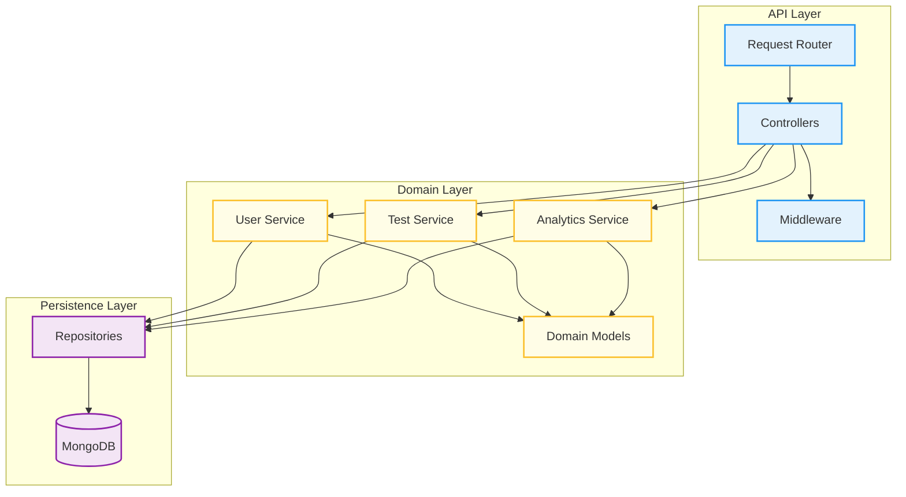
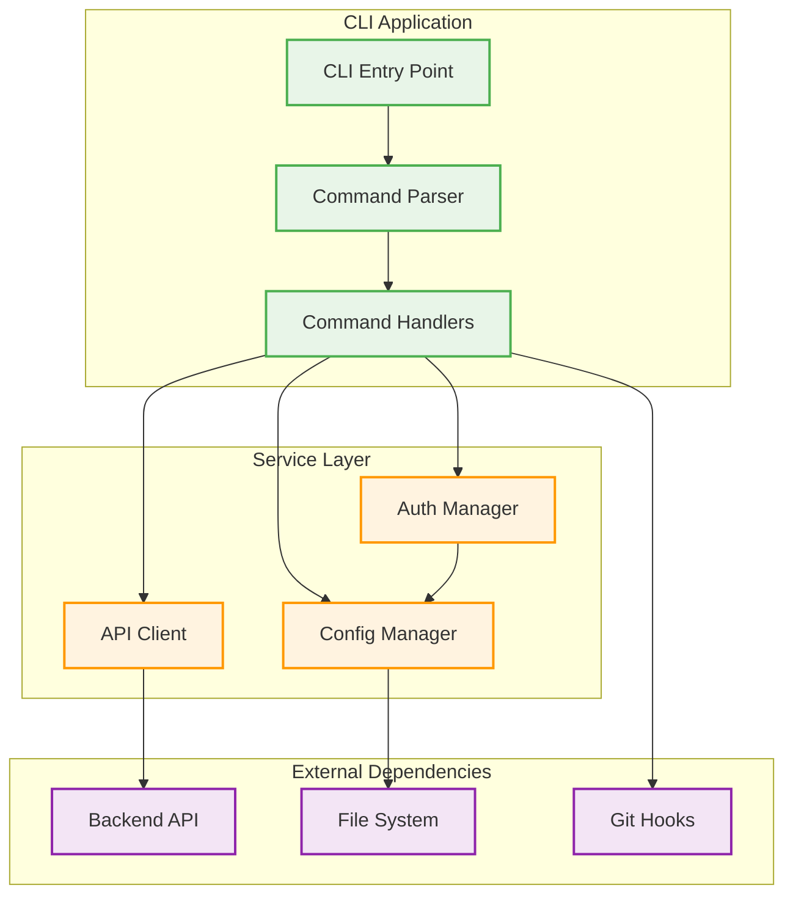

# This chapter need a review.

# Implementation

This chapter describes the implementation of the Keyla-TTT project, focusing on the API architecture and CLI components. The project follows a modular approach with clear separation between backend services and client interfaces.

## 1. API Backend

### 1.1 Architecture Overview

The backend follows a layered architecture pattern that promotes separation of concerns and maintainability. The architecture is structured in three main layers:

- **API Layer**: Handles HTTP requests, response formatting, and routing
- **Domain Layer**: Contains business logic and domain models
- **Persistence Layer**: Manages data storage and retrieval operations

This architectural pattern ensures that business logic remains independent from external concerns like HTTP protocols or database implementations, making the system more testable and maintainable.

### 1.2 Backend Functionality

The backend's functionalities include all the three main subdomains described in the design chapter:

#### User Management
In this subdomain (at the implementation level, it became a package), provides the following functionalities:
- **User Registration**: To create new user accounts with validation of username and password 
- **Authentication**: Implements secure login mechanism using JWT tokens for session management
- **Profile Management**: Allows users to view and update their profile settings

#### Typing Test Management
- **Test Generation**: Creates typing tests with configurable difficulty levels and durations
- **Text Repository**: Manages a collection of texts categorized by difficulty and theme
- **Test Execution**: Tracks user input during typing sessions and calculates performance metrics
- **Result Validation**: Ensures submitted test results are legitimate and within acceptable parameters

#### Analytics and Statistics
- **Performance Tracking**: Records and stores detailed statistics for each completed test
- **Progress Analysis**: Calculates user improvement trends over time
- **Comparative Analytics**: Provides insights into user performance relative to difficulty levels
- **Data Aggregation**: Generates summary statistics and performance reports

### 1.3 REST API Implementation

The REST API exposes the backend functionality through well-structured HTTP endpoints following RESTful conventions:

#### Authentication Endpoints
- `POST /api/v1/auth/register` - User registration with email and password
- `POST /api/v1/auth/login` - User authentication returning JWT token
- `POST /api/v1/auth/logout` - Token invalidation and session termination
- `GET /api/v1/auth/profile` - Retrieves authenticated user profile

#### User Management Endpoints
- `GET /api/v1/users/profile` - Fetch current user profile information
- `PUT /api/v1/users/profile` - Update user profile data
- `DELETE /api/v1/users/account` - Account deletion with data cleanup

#### Typing Test Endpoints
- `POST /api/v1/tests/generate` - Creates new typing test based on difficulty and duration parameters
- `GET /api/v1/tests/{testId}` - Retrieves specific test details
- `POST /api/v1/tests/{testId}/submit` - Submits completed test results for evaluation
- `GET /api/v1/tests/history` - Lists user's completed tests with pagination

#### Analytics Endpoints
- `GET /api/v1/analytics/user/{userId}` - Retrieves comprehensive user performance statistics
- `GET /api/v1/analytics/progress/{userId}` - Calculates and returns user progress metrics
- `GET /api/v1/analytics/summary` - Provides aggregated performance summary for the user

## 2. CLI Implementation

### 2.1 Architecture Overview

The CLI component serves as a command-line client that interacts with the backend API. It follows a command-pattern architecture with clear separation between command parsing, execution, and API communication.

The CLI architecture consists of:

- **Command Layer**: Handles command parsing and user interaction
- **Service Layer**: Manages API communication and data processing
- **Configuration Layer**: Handles persistent settings and authentication tokens

### 2.2 CLI Functionality

The CLI provides comprehensive functionality that mirrors and extends the backend capabilities:

#### Authentication Management
- **Login Command**: Authenticates users and stores JWT tokens locally for subsequent requests
- **Logout Command**: Invalidates stored tokens and clears authentication state
- **Profile Display**: Shows current user information and authentication status

#### Typing Test Interface
- **Test Generation**: Creates typing tests with customizable difficulty and duration settings
- **Interactive Testing**: Provides real-time typing interface with immediate feedback
- **Result Submission**: Automatically submits completed test results to the backend
- **Test History**: Displays user's previous test results with filtering options

#### Analytics and Reporting
- **Performance Overview**: Shows comprehensive statistics including WPM, accuracy, and progress trends
- **Progress Tracking**: Visualizes improvement over time with textual charts and metrics
- **Comparative Analysis**: Displays performance relative to difficulty levels and time periods

#### Development Integration
- **Git Hooks Installation**: Automatically installs pre-commit hooks for development workflow
- **Configuration Management**: Handles API endpoints, authentication tokens, and user preferences
- **Cross-Platform Support**: Ensures compatibility across different operating systems

### 2.3 CLI Command Structure

The CLI implements a hierarchical command structure with the following main commands:

#### Core Commands
- `keyla login` - Handles user authentication with interactive password input
- `keyla test` - Manages typing test generation, execution, and submission
- `keyla analytics` - Provides access to performance statistics and progress reports
- `keyla config` - Manages CLI configuration including API endpoints and display preferences

#### Development Commands
- `keyla hooks install` - Sets up Git hooks for automated workflow integration
- `keyla hooks uninstall` - Removes installed Git hooks
- `keyla version` - Displays CLI version and backend compatibility information

#### Utility Commands
- `keyla help` - Comprehensive help system with command-specific documentation
- `keyla status` - Shows current authentication status and API connectivity
- `keyla logout` - Clears stored authentication tokens and configuration

### 2.4 Integration Features

The CLI includes several advanced integration features:

#### API Communication
- **Automatic Token Management**: Handles JWT token storage, renewal, and expiration
- **Network Error Handling**: Implements retry mechanisms and graceful degradation for network issues
- **Response Caching**: Optimizes performance by caching frequently accessed data locally

#### Development Workflow
- **Git Integration**: Seamlessly integrates with Git repositories for automated testing workflows
- **Build System Support**: Compatible with various build systems and CI/CD pipelines
- **Configuration Profiles**: Supports multiple environment configurations for development, testing, and production

## 3. Technology Stack Summary

### Backend Technologies
- **Scala 3**: Main programming language with functional programming paradigms
- **Play Framework**: Web framework for REST API implementation
- **MongoDB**: NoSQL database for flexible data storage and high performance
- **SBT**: Build tool for dependency management and project compilation

### CLI Technologies
- **Kotlin**: Modern JVM language for cross-platform CLI development
- **Picocli**: Advanced command-line parsing with annotation-based configuration
- **Ktor Client**: HTTP client library for robust API communication
- **Gradle**: Build system with application plugin for distribution management

## 4. Deployment and Distribution

Both components are designed for easy deployment and distribution:

- **Backend**: Containerized using Docker for consistent deployment across environments
- **CLI**: Distributed as standalone executables with platform-specific installers
- **Configuration**: Environment-based configuration management for flexible deployment scenarios.

