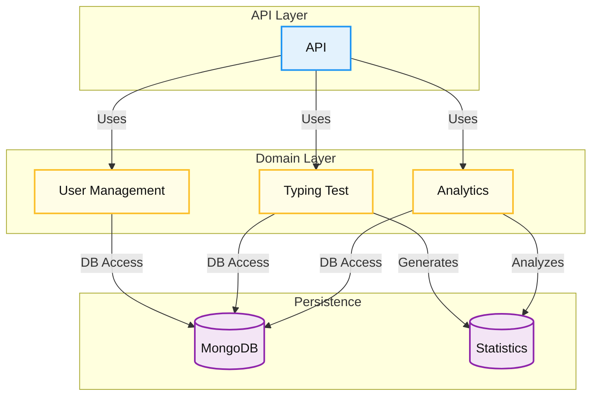

# Implementation

This chapter describes the main software components, the technologies used, the core classes and services of the Keyla-TTT project, also providing code examples and diagrams illustrating the dependencies between the various modules.

## 1. Software Components

The Keyla-TTT project is structured into the following main components:

- **Backend**: Implemented in Scala using SBT as the build tool, it exposes RESTful APIs and manages business logic.
- **Database**: MongoDB is used for persistent storage of users, test results, and analytical data.

## 2. Technologies Used

- **Scala 3**: Main programming language for the backend.
- **SBT**: Build tool for compiling and managing Scala project dependencies.
- **MongoDB**: NoSQL database for data persistence.
- **Docker**: For containerizing the application and its dependencies.
- **Play Framework**: Web framework for implementing RESTful APIs (inferred from the project structure).

## 3. Main Modules

### 3.1 User Management

Handles user registration, authentication, and profile management.

#### Main Classes

- `User`: Represents a user entity with attributes such as username, email, and password.
- `UserRepository`: Manages CRUD operations for users.
- `AuthService`: Handles authentication and JWT token generation.

#### Code Example

```scala
// User model
case class User(
  id: String,
  username: String,
  email: String,
  passwordHash: String,
  createdAt: Long
)

// User repository
trait UserRepository {
  def findById(id: String): Option[User]

  def findByUsername(username: String): Option[User]

  def insert(user: User): User

  def update(user: User): Option[User]

  def delete(id: String): Boolean
}
```

### 3.2 Typing Test

Manages the logic for typing tests, including test generation and result evaluation.

#### Main Classes

- `TypingTest`: Represents a typing test session.
- `TypingTestService`: Manages test creation and result validation.
- `TextRepository`: Provides texts for typing tests.

#### Code Example

```scala
// TypingTest model
case class TypingTest(
  id: String,
  text: String,
  difficulty: String,
  duration: Int,
  createdAt: Long
)

// Typing test service
class TypingTestService(textRepo: TextRepository){
  def generateTest(difficulty: String, duration: Int): TypingTest = {
    val text = textRepo.getRandomText(difficulty)
    TypingTest(
      id = UUID.randomUUID().toString,
      text = text,
      difficulty = difficulty,
      duration = duration,
      createdAt = System.currentTimeMillis()
    )
  }
}
```

### 3.3 Analytics

Collects and analyzes user performance data.

#### Main Classes

- `Statistics` (trait): Defines the structure for statistics.
- `UserStatistics`: Concrete implementation for user test results.
- `AnalyticsService`: Aggregates and analyzes statistics.

#### Code Example

```scala
// Already present in Statistics.scala
trait Statistics {
  /** Unique identifier of the user */
  def userId: String

  /** Unique identifier of the test */
  def testId: String

  /** Words per minute (WPM) calculated from the typing speed */
  def wpm: Double

  /** Accuracy percentage of the typed text compared to the target text */
  def accuracy: Double

  /** List of errors made during the typing test */
  def errors: List[Int]

  /** Timestamp of when the statistics were recorded */
  def timestamp: Long

  def copy(): Statistics
}
// Analytics service
class AnalyticsService(statsRepo: StatisticsRepository){
  def getUserPerformanceHistory(userId: String): List[UserStatistics] =
    statsRepo.findByUserId(userId)

  def calculateUserProgress(userId: String): ProgressMetrics = {
    val stats = getUserPerformanceHistory(userId)
    // Logic to calculate user progress
    ProgressMetrics()
  }
}
```

### 3.4 API

Exposes RESTful endpoints for communication with the frontend.

#### Main Classes

- `UserController`: Manages user-related API endpoints.
- `TypingTestController`: Manages typing test endpoints.
- `AnalyticsController`: Provides analytical data.

#### Code Example

```scala
// User controller
class UserController(userService: UserService, authService: AuthService) {
  def register = Action(parse.json) { request =>
    // Registration logic
    Ok(Json.obj("message" -> "User registered successfully"))
  }

  def login = Action(parse.json) { request =>
    // Login logic
    Ok(Json.obj("token" -> generatedToken))
  }
}
// Typing test controller
class TypingTestController(testService: TypingTestService) {
  def generateTest(difficulty: String, duration: Int) = Action {
    val test = testService.generateTest(difficulty, duration)
    Ok(Json.toJson(test))
  }

  def submitResult = Action(parse.json) { request =>
    // Logic to save and evaluate results
    Ok(Json.obj("message" -> "Test results submitted"))
  }
}
```

## 4. Module Dependency Diagram



## 5. Summary

The Keyla-TTT project is modularly structured with a clear separation between user management, typing test logic, analytics, and API layers. The use of Scala, MongoDB, and functional programming techniques ensures a scalable and maintainable architecture, while the container-based approach simplifies deployment.